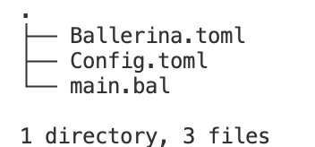

# Twilio Connector - Ballerina

In today’s interconnected world, communication is key, and what better way to enhance your application’s communication capabilities than by integrating [Twilio](https://www.twilio.com/en-us) with the [Ballerina](https://ballerina.io/) programming language? 

Ballerina, known for its simplicity and power in building cloud-native integrations, combines with Twilio’s versatile [communication APIs](https://dzone.com/articles/3-types-of-user-communication-apis-and-when-to-use) to help you send SMS, make voice calls, send WhatsApp messages, and more. 

In this guide, we’ll explore how the `ballerinax/twilio` package can empower you to build robust communication features effortlessly. Refer to [ballerina/twilio API Docs](https://lib.ballerina.io/ballerinax/twilio/latest) for more details.

## Prerequisites
- Install [Ballerina Swan Lake](https://ballerina.io/downloads/) and [Ballerina VS Code plugin](https://wso2.com/ballerina/vscode/).
- Create a [Twilio](https://www.twilio.com/en-us) account.
- Obtain [Twilio phone number](https://support.twilio.com/hc/en-us/articles/223136107-How-does-Twilio-s-Free-Trial-work-).
- Obtain [Twilio Auth Tokens](https://support.twilio.com/hc/en-us/articles/223136027-Auth-Tokens-and-How-to-Change-Them).
- Obtain the Twilio WhatsApp number from the [Console’s WhatsApp Sandbox](https://www.twilio.com/console/sms/whatsapp/sandbox).

## Sample 1: Send/Receive Calls and Messages With Ballerina

Create a new Ballerina package using the command below.

```
bal new send-receive-with-twilio
```
This creates a new Ballerina package in the default module with the `Ballerina.toml` file, which identifies a directory as a package and a sample source file (i.e., `main.bal`) with a main function.

To provide the configurations required, create a new file named `Config.toml`` and add the send/receive phone numbers, SID, and auth token received from Twilio. The file structure within the package will look like below.



Add the following code to `main.bal` file.

```ballerina
import ballerina/log;
import ballerinax/twilio;

configurable string accountSId = ?;
configurable string authToken = ?;
configurable string fromNumber = ?;
configurable string fromWhatsAppNumber = ?;
configurable string toNumber = ?;

configurable string message = "This is a test message from Ballerina";

//Create Twilio client
final twilio:Client twilio = check new ({twilioAuth: {accountSId, authToken}});

public function main() returns error? {
    //Send SMS
    twilio:SmsResponse smsResponse = check twilio->sendSms(fromNumber, toNumber, message);
    log:printInfo(string `SMS Response: ${smsResponse.toString()}`);

    //Get the details of SMS sent above
    twilio:MessageResourceResponse details = check twilio->getMessage(smsResponse.sid);
    log:printInfo("Message Detail: " + details.toString());

    //Make a voice call
    twilio:VoiceCallResponse voiceResponse = check twilio->makeVoiceCall(fromNumber, toNumber, {
        userInput: message,
        userInputType: twilio:MESSAGE_IN_TEXT
    });
    log:printInfo(string `Voice Call Response: ${voiceResponse.toString()}`);

    //Send whatsapp message
    twilio:WhatsAppResponse whatsappResponse = check twilio->sendWhatsAppMessage(fromWhatsAppNumber, toNumber, message);
    log:printInfo(string `WhatsApp Response: ${whatsappResponse.toString()}`);

    // Get Account Details
    twilio:Account accountDetails = check twilio->getAccountDetails();
    log:printInfo(string `Account Details: ${accountDetails.toString()}`);

}
```

Add the configuration values to the `Config.toml` file. It will look like below.

```
accountSId="xxxxxxxxxxxxxxxxxxxxxxx"
authToken="xxxxxxxxxxxxxxxxxxxxxxx"
fromNumber="+1xxxxxxxxxx"
fromWhatsAppNumber="+1xxxxxxxxxx"
toNumber="+1xxxxxxxxxx"
```

Then, run the program using `bal run    ` command, and you will see the following logs.

```
time = 2023-08-29T16:54:47.536-05:00 level = INFO module = anupama/twilio_samples message = "SMS Response: {\"sid\":\"SM12099885cce2c78bf5f50903ca83d3ac\",\"dateCreated\":\"Tue, 29 Aug 2023 21:54:47 +0000\",\"dateUpdated\":\"Tue, 29 Aug 2023 21:54:47 +0000\",\"dateSent\":\"\",\"accountSid\":\"xxxxxxxxxxxxx\",\"toNumber\":\"+1xxxxxxxxxx\",\"fromNumber\":\"+1xxxxxxxxxx\",\"body\":\"Sent from your Twilio trial account - This is a test message from Ballerina\",\"status\":\"queued\",\"direction\":\"outbound-api\",\"apiVersion\":\"2010-04-01\",\"price\":\"\",\"priceUnit\":\"USD\",\"uri\":\"/2010-04-01/Accounts/xxxxxxxxxxxxx/Messages/SM12099885cce2c78bf5f50903ca83d3ac.json\",\"numSegments\":\"1\"}"
time = 2023-08-29T16:54:47.694-05:00 level = INFO module = anupama/twilio_samples message = "Message Detail: {\"body\":\"Sent from your Twilio trial account - This is a test message from Ballerina\",\"numSegments\":\"1\",\"direction\":\"outbound-api\",\"fromNumber\":\"outbound-api\",\"toNumber\":\"+1xxxxxxxxxx\",\"dateUpdated\":\"Tue, 29 Aug 2023 21:54:47 +0000\",\"price\":\"\",\"errorMessage\":\"\",\"uri\":\"/2010-04-01/Accounts/xxxxxxxxxxxxx/Messages/SM12099885cce2c78bf5f50903ca83d3ac.json\",\"accountSid\":\"xxxxxxxxxxxxx\",\"numMedia\":\"0\",\"status\":\"sent\",\"messagingServiceSid\":\"\",\"sid\":\"SM12099885cce2c78bf5f50903ca83d3ac\",\"dateSent\":\"Tue, 29 Aug 2023 21:54:47 +0000\",\"dateCreated\":\"Tue, 29 Aug 2023 21:54:47 +0000\",\"errorCode\":\"\",\"priceUnit\":\"USD\",\"apiVersion\":\"2010-04-01\",\"subresourceUris\":\"{\"media\":\"/2010-04-01/Accounts/xxxxxxxxxxxxx/Messages/SM12099885cce2c78bf5f50903ca83d3ac/Media.json\",\"feedback\":\"/2010-04-01/Accounts/xxxxxxxxxxxxx/Messages/SM12099885cce2c78bf5f50903ca83d3ac/Feedback.json\"}\"}"
time = 2023-08-29T16:54:47.828-05:00 level = INFO module = anupama/twilio_samples message = "Voice Call Response: {\"sid\":\"CAaa2e5a5c7591928f7e28c79da97e615a\",\"status\":\"queued\",\"price\":\"\",\"priceUnit\":\"USD\"}"
time = 2023-08-29T16:54:47.993-05:00 level = INFO module = anupama/twilio_samples message = "WhatsApp Response: {\"sid\":\"SM3c272753409bd4814a60c7fd06d97232\",\"dateCreated\":\"Tue, 29 Aug 2023 21:54:47 +0000\",\"dateUpdated\":\"Tue, 29 Aug 2023 21:54:47 +0000\",\"dateSent\":\"\",\"accountSid\":\"xxxxxxxxxxxxx\",\"toNumber\":\"whatsapp:+1xxxxxxxxxx\",\"fromNumber\":\"whatsapp:+1xxxxxxxxxx\",\"messageServiceSid\":\"\",\"body\":\"This is a test message from Ballerina\",\"status\":\"queued\",\"numSegments\":\"1\",\"numMedia\":\"0\",\"direction\":\"outbound-api\",\"apiVersion\":\"2010-04-01\",\"price\":\"\",\"priceUnit\":\"\",\"errorCode\":\"\",\"errorMessage\":\"\",\"uri\":\"\",\"subresourceUris\":\"{\"media\":\"/2010-04-01/Accounts/xxxxxxxxxxxxx/Messages/SM3c272753409bd4814a60c7fd06d97232/Media.json\"}\"}"
time = 2023-08-29T16:54:48.076-05:00 level = INFO module = anupama/twilio_samples message = "Account Details: {\"sid\":\"xxxxxxxxxxxxx\",\"name\":\"My first Twilio account\",\"status\":\"active\",\"type\":\"Trial\",\"createdDate\":\"Fri, 18 Aug 2023 21:14:20 +0000\",\"updatedDate\":\"Fri, 18 Aug 2023 21:14:54 +0000\"}"
```

Also, you will get an SMS, a voice call, and a WhatsApp message to the specified number.

Are you interested in seeing this sample's sequence diagram generated by the Ballerina VS Code plugin? You can see the interactions with Twilio clearly in this diagram without reading the code. The Sequence diagram can capture how the logic of your program flows, how the concurrent execution flow works, which remote endpoints are involved, and how those endpoints interact with the different workers in the program. See the [Sequence diagram view](https://wso2.com/ballerina/vscode/docs/implement-the-code/sequence-diagram-view/) for more details.


### Complete code

Refer to the code in [send-receive-with-twilio](https://github.com/learn-ballerina/ballerina-library-samples/tree/main/twilio/send-recieve-with-twilio)

## Sample 2: Use TwiML for Programmable Messaging With Ballerina

The [TwiML](http://twilio.com/docs/messaging/twiml) (Twilio Markup Language) is a set of instructions you can use to tell Twilio what to do when you receive an incoming call, SMS, MMS, or WhatsApp message.

Let’s see how to write a Ballerina program that makes a voice call with the instructions of the given TwiML URL. Here, we need to have [a URL that returns TwiML Voice instructions](https://lib.ballerina.io/ballerinax/twilio/2.0.0#VoiceCallInputType) to make the call. 

If you don’t have such a URL that returns TwiML, you can write a simple Ballerina HTTP service to return it as follows and run it. The instruction returned by this service will contain a bell sound, which is looped ten times. 

```ballerina
import ballerina/http;

service /twilio on new http:Listener(9090) {

    resource function post voice() returns xml {
        xml response = xml `<?xml version="1.0" encoding="UTF-8"?>
        <Response>
            <Play loop="10">https://api.twilio.com/cowbell.mp3</Play>
        </Response>`;
        return response;
    }
}
```

If you are running the above service locally, you need to expose it to external so that it can be accessed by Twilio when making the call. You can use [ngrok](https://ngrok.com/) for that, which is a cross-platform application that enables developers to expose a local development server to the Internet with minimal effort.

Expose the above service with the following `ngrok` command.

```
./ngrok http 9090
```

This will return a URL similar to the following: 

```
https://a624-2600-1700-1bd0-1390-9587-3a61-a470-879b.ngrok.io
```

Then, you can append it with the service path and resource path in your above Ballerina service to be used with the Twilio voice call example. 

```
https://a624-2600-1700-1bd0-1390-9587-3a61-a470-879b.ngrok.io/twilio/voice
```

Next, write your Ballerina code as follows. Use the above complete ngrok URL as the `voiceTwimUrl` configurable. 

```ballerina
import ballerina/log;
import ballerinax/twilio;

configurable string accountSId = ?;
configurable string authToken = ?;
configurable string fromNumber = ?;
configurable string toNumber = ?;
configurable string voiceTwimUrl = ?;

//Create Twilio client
final twilio:Client twilio = check new ({twilioAuth: {accountSId, authToken}});

public function main() returns error? {
    //Make a voice call
    twilio:VoiceCallResponse voiceResponse = check twilio->makeVoiceCall(fromNumber, toNumber, {
        userInput: voiceTwimUrl,
        userInputType: twilio:TWIML_URL
    });
    log:printInfo(string `Voice Call Response: ${voiceResponse.toString()}`);

}
```

When running the program, you will receive a phone call to the specified number with a Bell sound of 10 times. You can see the below logs in your Ballerina application.

```
time = 2023-08-29T17:03:13.804-05:00 level = INFO module = anupama/twilio_samples message = "Voice Call Response: {\"sid\":\"CA3d8f5cd381a4eaae1028728f00770f00\",\"status\":\"queued\",\"price\":\"\",\"priceUnit\":\"USD\"}"
```

### Complete code for instruction server

Refer to the code in [twiml-instruction-server](https://github.com/learn-ballerina/ballerina-library-samples/tree/main/twilio/twiml-intruction-server)

### Complete code for instruction server

Refer to the code in [twiml-voice-call](https://github.com/learn-ballerina/ballerina-library-samples/tree/main/twilio/twiml-voice-call)

## Conclusion

In conclusion, Twilio’s synergy with Ballerina through the `ballerinax/twilio` package presents a powerful tool for elevating your application’s communication prowess. The showcased sample code highlights its ease and adaptability, setting it apart from connectors in other languages. 

Hope you’ve enjoyed making calls and sending messages using this seamless integration.