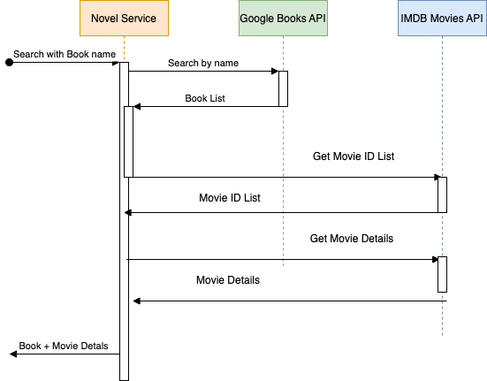

# Ballerina HTTP Service for book and movie search

## Source code

The full source code for the scenario can be found in [ballerina-scenarios repo.](https://github.com/anupama-pathirage/ballerina-scenarios/tree/main/ballerina-http-service-for-books-search)

## Sample Use case

Refer to the scenario below. 

## External Calls

### Google Books API
https://www.googleapis.com/books/v1/volumes?q=intitle:war%20and%20peace

### IMDB Movie API

https://imdb-api.com/en/API/SearchMovie/k_mhb0408y/war%20and%20peace

https://imdb-api.com/en/API/Trailer/k_mhb0408y/tt3910804

## Test URL

curl "localhost:9090/books/search?name=war%20and%20peace" | jq